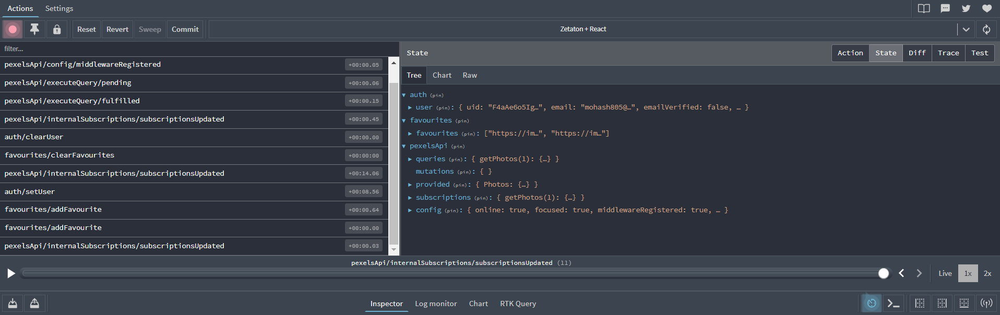

# Zetaton + React

## project setup

1.  clone the repo

```bash
git clone https://github.com/Muhammad-Ashraf9/zetaton-react.git
```

2.  cd into the project

```bash
cd zetaton-react
```

3.  install dependencies

```bash
npm install
```

4.  start the project

```bash
npm run dev
```

---

## Features

- Sign-up, sign-in and sign-out functionality using Firebase authentication and presisting the authentication state using `redux-toolkit`
- Form validation using `react-hook-form`
- Fetch photos from the Pexels API ([https://www.pexels.com/api/](https://www.pexels.com/api/)) using `RTK Query` and display them in a grid
- `Pagination` to navigate through the photos
- `Loading Skeleton` to display a loading state while fetching the photos
- For signed in users, they can `like` and `unlike` photos and the liked photos will be saved in the firestore database
- `Favorites` screen to display all the favorite images stored by the user.
- user can `delete` the favorite images from the `Favorites` screen

---

## Screenshots



---

## Video

[Zetaton + React (Video)](https://drive.google.com/drive/folders/1tjKGlEBS8wqhmj8jEaWVv5l8TX2utvFQ?usp=sharing)

## project structure

- inspired by [bulletproof-react](https://github.com/alan2207/bulletproof-react/blob/master/docs/project-structure.md)

---

## some previous work with React

- [Redux - scoop client](https://github.com/Muhammad-Ashraf9/scoop-client)
- [Context API -Typescript - World wise - jonas schmedtmann - React course](https://github.com/Muhammad-Ashraf9/world-wise)
- [quizzz](https://github.com/Muhammad-Ashraf9/quizzz)
